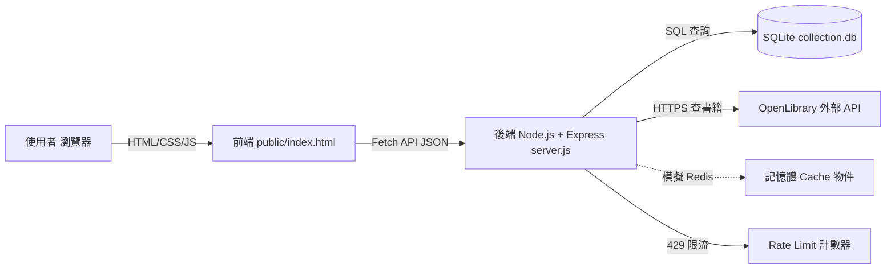
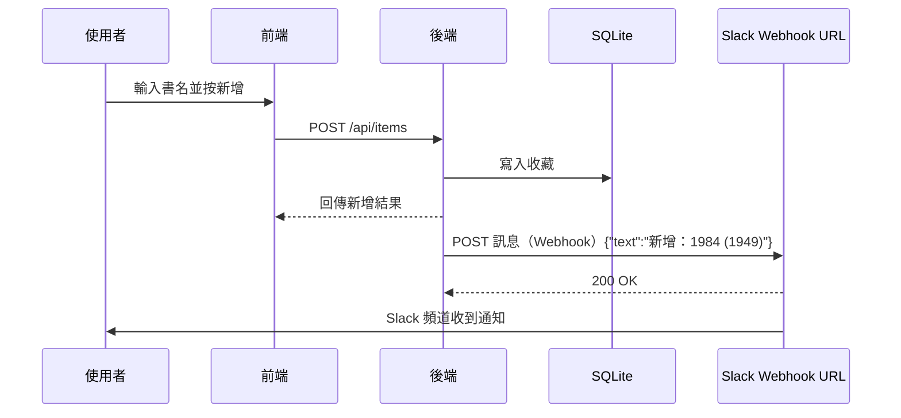

# 我的收藏清單（My Collection）

一個極簡但完整的 Web 應用程式，用來讓 **IT Project Officer** 透過實作搞懂前後端協作、API、Git、環境變數、Rate Limit、Cache、Webhook 等常見術語。

功能：新增 / 瀏覽 / 刪除電影或書籍；新增書籍時自動呼叫 OpenLibrary API 補齊出版年份。

---

## 1. 安裝與執行步驟

> 前提：電腦已安裝 [Node.js](https://nodejs.org/)（建議 v18+）。在終端機（Windows 用 PowerShell）輸入以下指令。

```bash
# 1) 進入專案資料夾
cd my-collection

# 2) 安裝後端套件（express + better-sqlite3）
npm install

# 3) 複製環境變數範本，並依需求修改 PORT
copy .env.example .env        # Windows PowerShell 用 Copy-Item .env.example .env

# 4) 載入環境變數並啟動（Windows PowerShell）
$env:PORT=3000; npm start
#    macOS / Linux:  PORT=3000 npm start

# 5) 瀏覽器打開
#    http://localhost:3000
```

看到 `Server running at http://localhost:3000` 代表成功。

---

## 2. 系統架構圖



---

## 3. API 一覽（也可用 Postman 測）

| Method | URL | 說明 | Body 範例 |
|---|---|---|---|
| GET | `/api/items` | 取得所有收藏 | — |
| POST | `/api/items` | 新增收藏（書籍會自動補年份） | `{"type":"book","title":"Harry Potter"}` |
| DELETE | `/api/items/:id` | 刪除指定 id | — |

### Postman 測試教學
1. 開啟 Postman → 新增 Request。
2. **GET 列表**：Method 選 `GET`，URL 填 `http://localhost:3000/api/items`，按 Send，下方 Body 會看到 JSON 陣列。
3. **POST 新增**：Method 選 `POST`，URL 同上；切到 **Body → raw → JSON**，貼上 `{"type":"book","title":"1984"}`，按 Send。回應應含自動補到的 `year`。
4. **體驗 429**：連續按 Send 超過 5 次（1 分鐘內），就會收到 `429 Too Many Requests`。
5. **DELETE**：先從 GET 結果複製一個 `id`，Method 選 `DELETE`，URL 填 `http://localhost:3000/api/items/1`，Send。

> Postman 是 PM / 後端常用的「API 測試工具」，好處是不用寫前端就能驗證後端邏輯、把測試案例存成集合分享給團隊。

---

## 4. Git 版本控制教學

```bash
# 1) 初始化（只做一次）
git init

# 2) 告訴 Git 你是誰（commit 記錄用）
git config user.name "Your Name"
git config user.email "you@example.com"

# 3) 把所有檔案加入暫存（.gitignore 裡的會自動略過）
git add .

# 4) 提交；訊息要寫清楚「做了什麼」，未來追 bug 才找得到
git commit -m "feat: 新增收藏清單前後端與 SQLite"

# 5) 在 GitHub 新建 repo 後，綁定遠端並推送
git remote add origin https://github.com/你的帳號/my-collection.git
git branch -M main
git push -u origin main

# 日常協作
git pull          # 從遠端抓隊友的最新更新下來
git add .
git commit -m "fix: 修正刪除後畫面未更新"
git push          # 把你的 commit 推上遠端
```

---

## 5. 關鍵術語 — 專案經理版解釋

| 術語 | PM 白話解釋 |
|---|---|
| **API** | 兩個系統之間的「服務窗口」。前端跟後端說「給我列表」，後端回 JSON；就像你跟其他部門拿表單，對方照固定格式給你。 |
| **Env（環境變數）** | 不寫死在程式碼裡的設定值（阜號、密鑰、資料庫密碼）。好處：不同環境（dev/test/prod）可設不同值，且機密不會進 Git 外洩。 |
| **Rate Limit** | 流量管制，例如「每分鐘最多 5 次」。超過就回 `429`。目的：防止被爬蟲/惡意使用者灌爆，也保護外部 API 不被對方鎖。 |
| **Webhook** | 「事件發生時自動呼叫對方 URL」。例如新增收藏後，後端自動 POST 一則訊息到 Slack；跟 API 差別在：API 是你主動去問，Webhook 是事件發生時對方自動通知你。 |
| **Redis** | 一種超快的「記憶體資料庫」，最常用來做 **Cache（快取）**。把外部 API 查過的結果暫存，下次直接用，省時間也省對方呼叫額度。失效策略：TTL（一段時間後自動刪除）或資料更新時主動清除。 |
| **Postman** | 測試 API 的圖形化工具。不用寫前端就能打 GET/POST/DELETE、看回傳、把測試案例存起來分享。PM 驗收後端功能很常用。 |
| **Commit** | 把程式碼的一次修改「存檔快照」，附一段說明訊息。commit 訊息寫得好，未來追 bug、做版本回溯都很快。 |
| **Push** | 把本地的 commit 上傳到遠端（如 GitHub），隊友才看得到。 |
| **Pull** | 從遠端把隊友最新的修改抓下來合併到自己電腦。開工前先 pull，可減少衝突。 |
| **Git Flow** | 一種分支管理策略：`main`（正式上線）、`develop`（整合測試）、`feature/xxx`（開發中功能）、`hotfix`（線上緊急修 bug）。好處是多人協作時不會互相踩到，PM 可依分支判斷功能在哪個階段。 |

---

## 6. Webhook 虛構情境（未來擴充，不實作）

**情境**：每當使用者新增一筆收藏，系統自動發一則通知到 Slack 頻道 `#new-collection`，讓團隊知道最近大家在看什麼書/電影。

### 流程圖



**實作重點（未來）**：在 `POST /api/items` 寫入 DB 成功後，多呼叫一次 `fetch(SLACK_WEBHOOK_URL, {method:'POST', body:...})`；Webhook URL 存在 `.env`，不能寫死。要注意重試機制與失敗不影響主流程（非同步/背景處理）。

---

## 7. 檔案結構

```
my-collection/
├── server.js          # 後端：Express + SQLite + Rate Limit + Cache + 外部 API
├── package.json       # 專案設定與相依套件
├── .gitignore         # 不進版控的檔案清單
├── .env.example       # 環境變數範本
├── public/
│   └── index.html     # 前端：HTML + CSS + JS（Fetch API）
└── README.md
```

---

## 分支演示（Branch Demo）

呢行係喺 feature/add-branch-demo 分支加入嘅，用嚟演示 branch 工作流。

